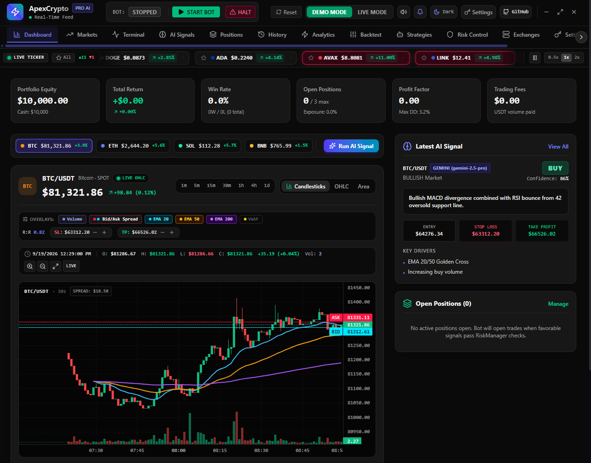
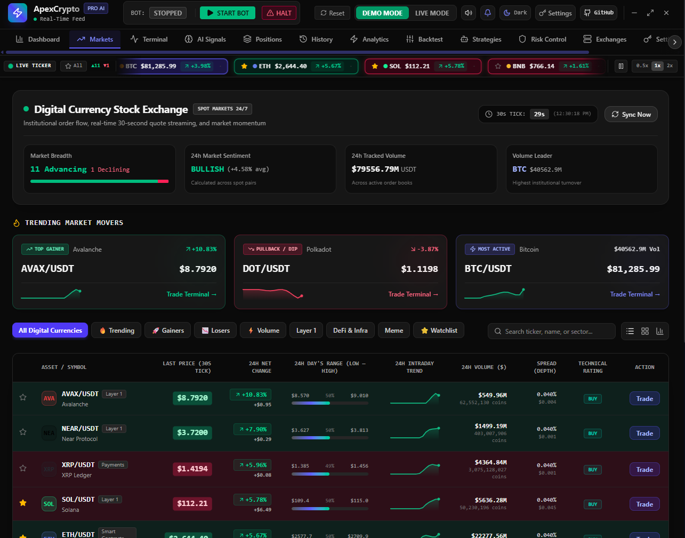
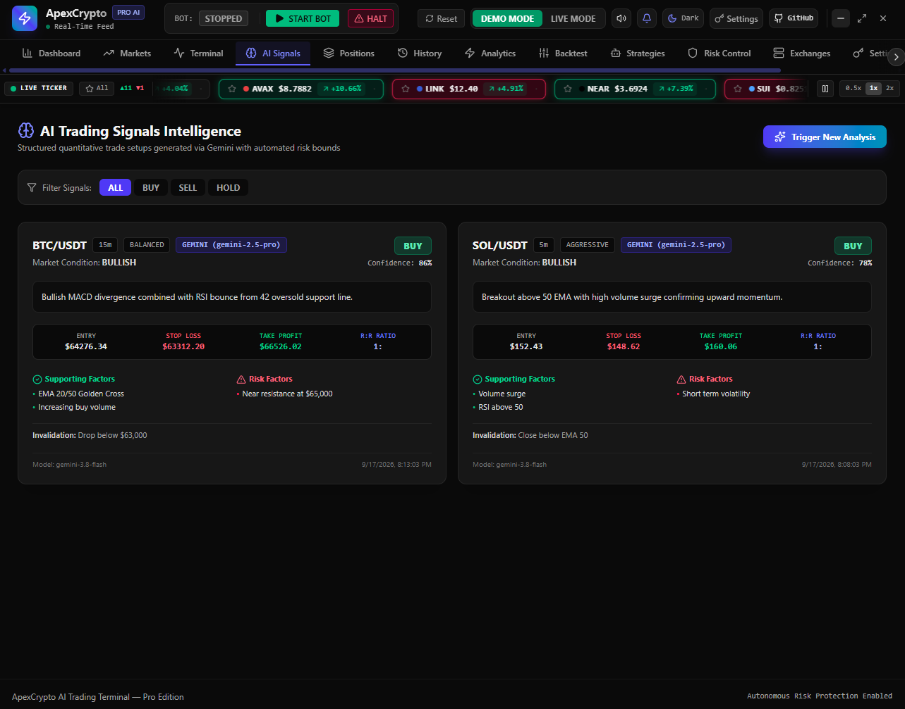
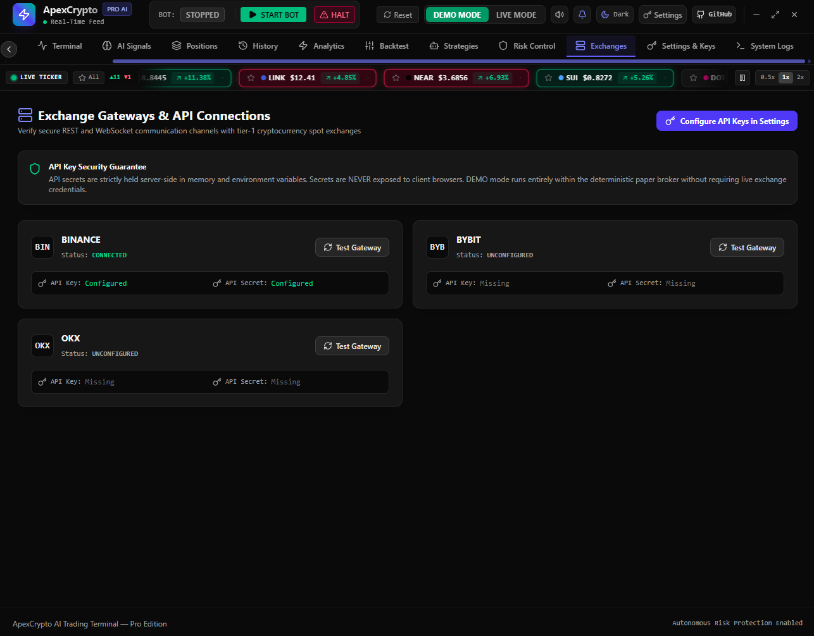
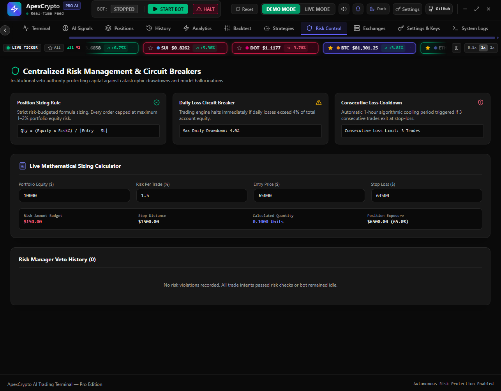
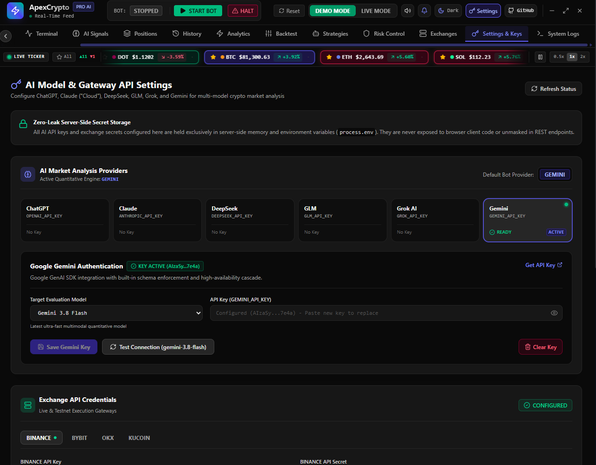

# ApexCrypto AI Trading Bot

<p align="center">
  <a href="https://SamDesantos.github.io/Apex-Trading-Bot/">
    
  </a>
  &nbsp;
  <a href="/ApexCrypto.exe">
    
  </a>
</p>

<p align="center">

**An AI-Powered Cryptocurrency Trading & Market Analysis Bot**

A modern cryptocurrency trading Bot built with **AI technologies**, designed to provide market analysis, portfolio management, backtesting, trading simulation and automated trading capabilities in a unified desktop-style interface.

</p>

---

## Overview

**ApexCrypto AI Trading Bot** is a modern cryptocurrency analysis and trading platform that combines real-time market data, technical analysis, portfolio management, trading simulation, backtesting and AI-assisted market analysis into a single application.

The project is designed with a modern frontend architecture based on:

* Lightweight Charts
* Recharts
* Lucide Icons
* Motion
* Claude / ChatGPT / Gemini / Grok / Deepseek / GLM

The desktop version is run as a Portable application without setup.

---

# ✨ Features

## 📊 Market Dashboard

A comprehensive market dashboard provides an overview of cryptocurrency markets and trading activity.

Features include:

* Cryptocurrency market overview
* Real-time or simulated market data
* Price monitoring
* Market statistics
* Trading pair information
* Price changes
* Market trend visualization
* Interactive charts
* Market activity indicators

The dashboard is designed to provide the most important market information in a single interface.

---

## 📈 Advanced Charts

The application includes interactive financial charts powered by **Lightweight Charts**.

Charts can be used for:

* Price analysis
* Candlestick visualization
* Market movement analysis
* Technical indicator visualization
* Historical price analysis
* Trading strategy evaluation

The charting system is designed to provide a trading-terminal-style experience inside the application.

---

## 🤖 AI Market Analysis

ApexCrypto integrates AI capabilities to assist with cryptocurrency market analysis.

AI-powered functionality can be used to analyze:

* Market conditions
* Price movements
* Technical indicators
* Trading signals
* Market trends
* Potential scenarios
* Strategy information

> AI-generated analysis should be considered informational and should not be treated as financial advice.

---

# 🧠 AI Trading Assistant

The AI assistant provides an interactive interface for working with market information.

Users can provide market-related questions and receive AI-generated analysis based on the available data.

Example use cases:

```text
Analyze BTC/USDT

What is the current market trend?

Analyze the current technical indicators.

Explain the current market structure.

What signals are currently visible?
```

The AI layer is designed to complement traditional technical analysis rather than replace it.

---

# 💼 Portfolio Management

The application includes portfolio functionality for monitoring trading assets and account information.

Portfolio features include:

* Asset balances
* Portfolio value
* Position tracking
* Profit and loss information
* Asset allocation
* Trading history
* Portfolio statistics

The portfolio system can be used for simulated trading as well as integration with supported trading environments.

---

# 🧪 Backtesting

ApexCrypto includes a backtesting environment for evaluating trading strategies against historical market data.

Backtesting allows users to evaluate a strategy before applying it to a live trading environment.

Typical backtesting workflow:

```text
Historical Market Data
        ↓
Trading Strategy
        ↓
Signal Generation
        ↓
Simulated Trades
        ↓
Performance Analysis
```

Possible metrics include:

* Total return
* Number of trades
* Winning trades
* Losing trades
* Win rate
* Drawdown
* Profit and loss
* Strategy performance

Backtesting results depend on the quality and period of the historical data and the assumptions used by the simulation.

---

# 🤖 Trading Bot

The project includes functionality for automated trading strategies.

A trading bot can:

* Monitor market data
* Evaluate trading conditions
* Generate signals
* Execute configured strategies
* Track positions
* Monitor trading activity
* Record trading results

The architecture allows trading strategies to be separated from the user interface and evaluated independently.

---

# 🧮 Trading Simulation

The platform can be used in simulation mode to test trading ideas without directly risking real funds.

Simulation mode is useful for:

* Learning
* Strategy testing
* Debugging
* Backtesting
* Evaluating trading logic
* Testing portfolio management

This makes it possible to experiment with trading strategies before connecting the application to a live exchange.

---

# 🔌 Exchange Integration

The backend architecture is designed to communicate with cryptocurrency exchange APIs.

Exchange functionality can be used for operations such as:

* Market data retrieval
* Account information
* Balance retrieval
* Order management
* Trading activity
* Market monitoring

Exchange availability depends on the API implementation and configuration used by the application.

---

## 📸 Screenshots

### Dashboard



### Markets



### Ai Signals



### Exchanges



### Risk Control



### Settings



---

# ⚙️ Technical Architecture

The application uses a client/server architecture.

```text
┌──────────────────────────────────────┐
│                    UI                │
│                                      │
│ Dashboard                            │
│ Charts                               │
│ Portfolio                            │
│ Trading                              │
│ Backtesting                          │
│ AI Analysis                          │
└──────────────────┬───────────────────┘
                   │
                   │ HTTP API
                   ▼
┌──────────────────────────────────────┐
│                  Backend             │
│                                      │
│ Market API                           │
│ Portfolio API                        │
│ Trading API                          │
│ Backtesting                          │
│ AI Services                          │
│ Exchange Services                    │
└──────────────────┬───────────────────┘
                   │
          ┌────────┴────────┐
          ▼                 ▼
     Exchange APIs       AI Services
```

---

# ⚠️ Risk Disclaimer

ApexCrypto is a software project for cryptocurrency market analysis, trading experimentation, automation and strategy development.

Cryptocurrency markets are highly volatile and trading can result in significant financial losses.

Nothing in this software, its AI-generated analysis, trading signals, strategies, examples or documentation constitutes financial, investment, legal or other professional advice.

Users are responsible for understanding the risks associated with cryptocurrency trading and for configuring the application appropriately.

When using live trading functionality, users should independently verify orders, API permissions, exchange settings and trading strategies.

---

# 🧪 Recommended Usage

For testing a new strategy, the recommended workflow is:

```text
1. Configure strategy
        ↓
2. Backtest
        ↓
3. Analyze results
        ↓
4. Run simulation
        ↓
5. Monitor performance
        ↓
6. Review strategy
        ↓
7. Consider live deployment
```

Live trading should only be enabled after independently validating the strategy and configuration.

---

# 🎯 Project Goals

The long-term goals of ApexCrypto include:

* Modern cryptocurrency trading interface
* AI-assisted market analysis
* Strategy development
* Automated trading
* Advanced backtesting
* Portfolio analytics
* Exchange integrations
* Desktop deployment
* Modular trading architecture
* Improved risk-management tools
* Extensible AI capabilities

---

# 🧩 Extensibility

The application is designed to allow additional functionality to be added over time.

Potential extensions include:

* Additional exchanges
* More technical indicators
* Additional AI models
* Strategy plugins
* Advanced risk management
* Trading alerts
* Notifications
* Additional chart types
* Strategy optimization
* Paper trading
* Advanced portfolio analytics

---

## 🌐 Live Demo

Experience **ApexCrypto** directly in your browser:

<p align="center">
  <a href="https://SamDesantos.github.io/Apex-Trading-Bot/">
    
  </a>
</p>

> 💡 No installation required. Open the demo and explore the application directly in your browser.


---

# 📜 License

Distributed under the **MIT** License. See LICENSE for more information.

---

# ⭐ Support the Project

If you find ApexCrypto useful:

* ⭐ Star the repository
* 🐛 Report bugs
* 💡 Suggest features
* 🔧 Submit improvements
* 📖 Improve the documentation

---

# 📌 Project Status

**Development Status:** Active Development

The project is continuously evolving and some features may change between releases.

APIs, exchange integrations, AI functionality and trading behavior should be tested carefully before being used in a production or live-trading environment.

---

## ApexCrypto

**AI-powered cryptocurrency analysis, trading, automation and strategy development in one modern terminal.**
